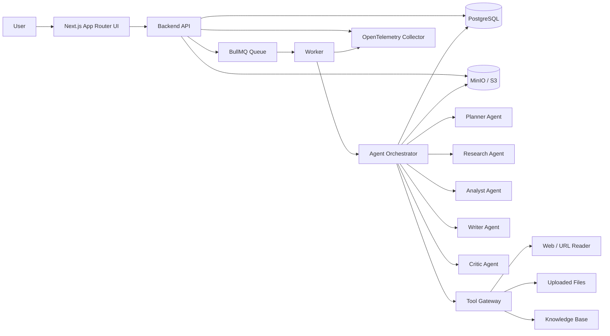
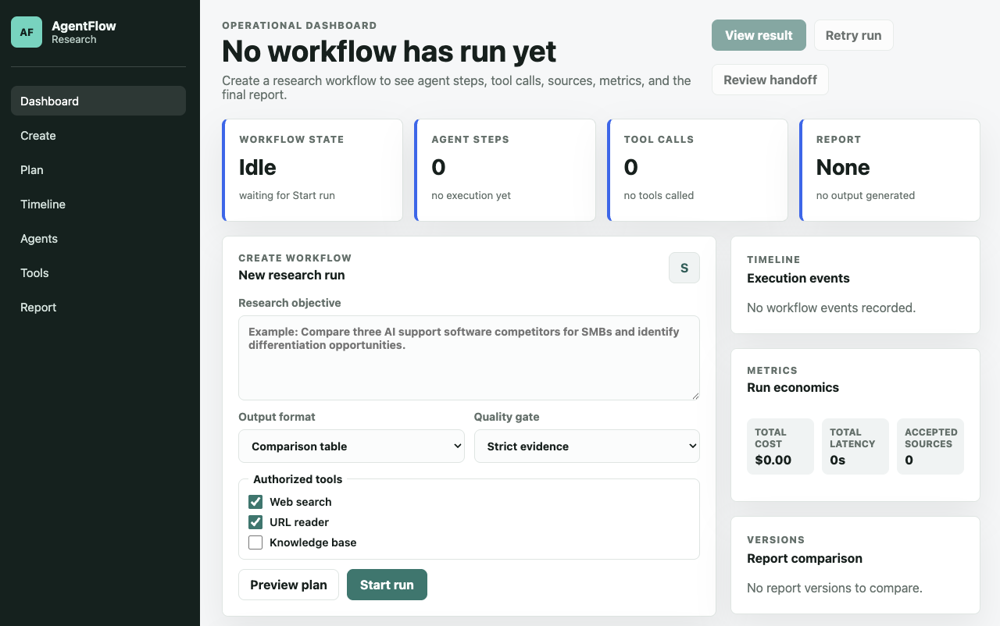
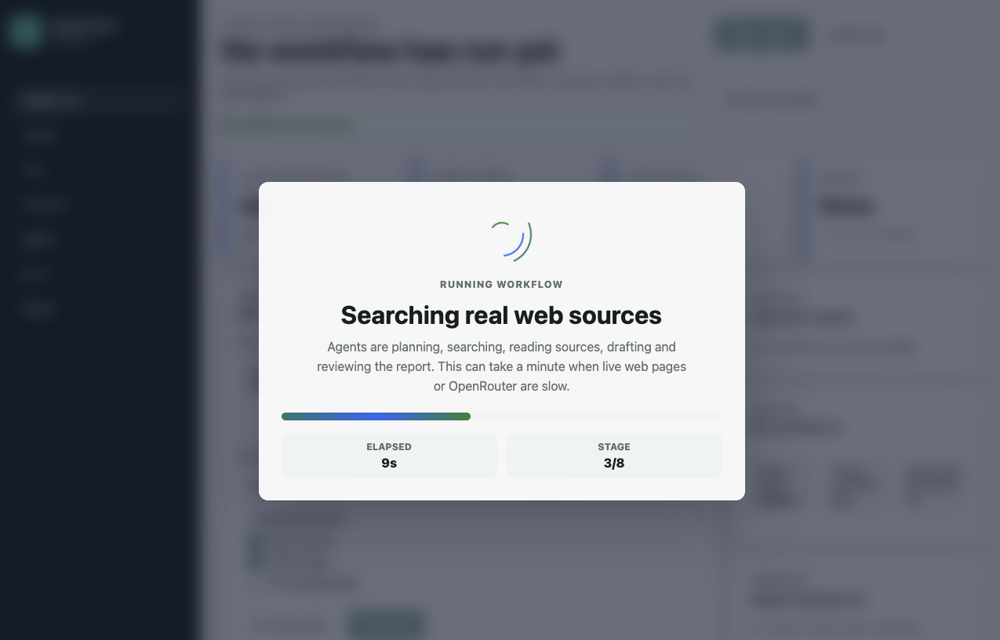
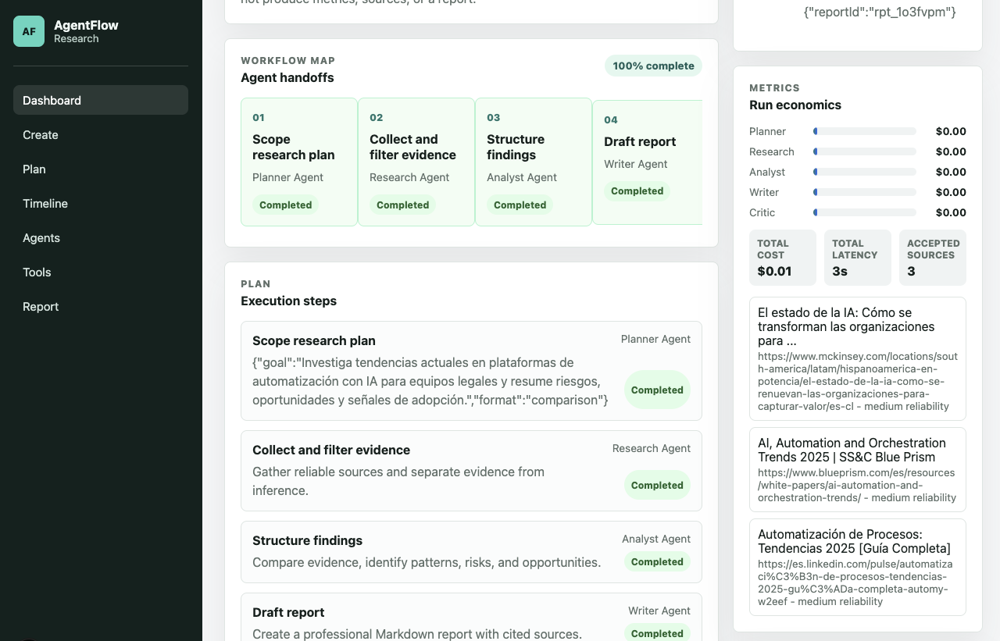
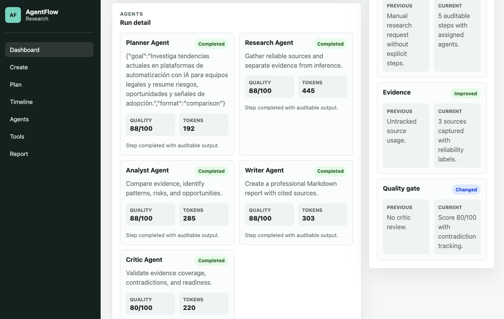
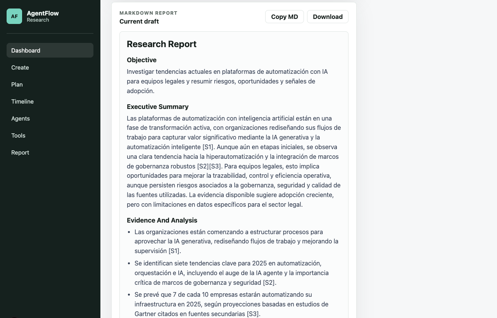

# AgentFlow Research

AgentFlow Research is a multi-agent research automation product. A user submits a research goal, the system plans the work, assigns steps to specialized agents, executes approved tools, validates the output, and produces a sourced Markdown report with an auditable workflow trail.

The project is designed as a real research workflow system beyond a single chat interface: roles, state, tool governance, retries, validation, evaluations, and observability are first-class concerns.

## What It Builds

- A Next.js workflow UI for creating and monitoring research runs.
- A backend API for users, workspaces, workflows, reports, sources, and audit events.
- A worker that executes queued agent steps.
- A multi-agent orchestrator using explicit state transitions.
- Controlled tool execution with schemas, allowlists, timeouts, retries, and logs.
- PostgreSQL for durable workflow state.
- Redis and BullMQ for background jobs.
- MinIO for uploaded files and generated reports.
- OpenTelemetry for traces, metrics, and logs.
- Evaluation datasets for quality, security, and reliability checks.

## Product Flow

1. User creates a workflow with a natural-language research objective.
2. Planner Agent converts the objective into a structured plan.
3. Worker enqueues executable steps for specialized agents.
4. Agents call only approved tools through typed tool contracts.
5. Tool calls, sources, costs, latency, errors, and retries are persisted.
6. Writer Agent drafts the final report from verified intermediate outputs.
7. Critic Agent checks objective fit, sourcing, contradictions, and injection risk.
8. User reviews the report, timeline, tool log, and evaluation signals.

The local MVP exposes this flow through `POST /api/workflows` and `POST /api/workflows/:workflowId/retry`. Workflow views are persisted in `.agentflow/workflows.json` for local review runs.

When `DATABASE_URL` is configured, the API persists workflows, steps, agent runs, tool calls, sources, reports, evaluations, and workflow events in PostgreSQL. The default execution mode is `AGENTFLOW_EXECUTION_MODE=inline`; setting `AGENTFLOW_EXECUTION_MODE=queue` with `REDIS_URL` stores a running workflow and enqueues execution for the BullMQ worker.

## Architecture



More detail is in [docs/architecture.md](docs/architecture.md).

## Agent Roles

- Planner Agent: turns the request into an objective, questions, subtasks, tool needs, completion criteria, risks, and assumptions.
- Research Agent: finds and summarizes sources, keeps facts separate from inference, and rejects weak sources when needed.
- Analyst Agent: compares data, identifies patterns, flags contradictions, and keeps claims traceable.
- Writer Agent: produces the final report in a professional format with sources.
- Critic Agent: validates answer quality, sourcing, contradictions, likely hallucinations, and retry needs.

See [docs/agents-and-tools.md](docs/agents-and-tools.md).

## Local Setup

Prerequisites:

- Docker and Docker Compose.
- Node.js 22 or newer.
- A local `.env` based on `.env.example`.
- An OpenRouter API key for live model-backed planner, writer, and critic agents.

Start infrastructure:

```bash
cp .env.example .env
docker compose up -d
```

Docker stores local service data under `./data/postgres`, `./data/redis`, and `./data/minio`. Those directories are ignored by git, while `data/.gitkeep` keeps the parent folder present.

Services exposed by `docker-compose.yml`:

- PostgreSQL: `localhost:5432`
- Redis: `localhost:6379`
- MinIO API: `localhost:9000`
- MinIO Console: `http://localhost:9001`
- OpenTelemetry Collector OTLP gRPC: `localhost:4317`
- OpenTelemetry Collector OTLP HTTP: `localhost:4318`

Application commands:

```bash
npm install
npm run db:migrate
npm run dev
npm run dev:worker
```

Run `npm run build` from a separate terminal only after stopping `npm run dev`. Next.js writes development and production artifacts to `.next`; mixing both processes can leave the dev server with stale client manifests. If that happens, stop `npm run dev` and start it again.

Execution modes:

- `AGENTFLOW_EXECUTION_MODE=inline`: route handlers run the deterministic workflow and persist the completed result. This is the default reviewer mode.
- `AGENTFLOW_EXECUTION_MODE=queue`: route handlers persist a running workflow and enqueue a BullMQ job. Run `npm run dev:worker` with `DATABASE_URL` and `REDIS_URL` so the worker can complete and persist the result.

Live model mode:

- Set `LLM_PROVIDER=openrouter`.
- Set `OPENROUTER_API_KEY` to your OpenRouter key.
- Set `OPENROUTER_MODEL` to the model slug you want to use, for example `openrouter/free`.
- `OPENROUTER_AGENTS=writer` is the default production-safe path: deterministic planner and critic, model-backed report writing. Use `planner,writer,critic` only if you want fully model-driven orchestration.
- If the key is missing or left as the placeholder, the app keeps using deterministic agents so local tests remain reproducible.

Detailed setup is in [docs/local-setup.md](docs/local-setup.md).

## First Run

Use this prompt for the first end-to-end validation run:

```text
Investiga tendencias actuales en plataformas de automatizacion con IA para equipos legales y resume riesgos, oportunidades y senales de adopcion con fuentes reales.
```

Expected visible behavior:

- The workflow enters `planned`, then `running`.
- The generated plan lists research questions, subtasks, tools, risks, and completion criteria.
- The timeline shows agent steps, tool calls, retries, cost, latency, and sources.
- The report includes an executive summary, competitor table, opportunities, risks, and citations.
- The Critic Agent either approves the report or requests a bounded retry for a specific step.

More workflow examples are in [docs/workflows.md](docs/workflows.md).

## Product Screenshots

The interface is built around a single operational workspace: users create a research objective, monitor agent execution, review evidence, and open the generated Markdown report without leaving the dashboard.

### Workflow Creation



The initial dashboard exposes the research form, execution metrics, authorized tools, timeline, and result shortcuts. The system generates a short workflow title automatically from the objective.

### Live Execution Progress



During execution, a full-screen progress overlay keeps the user informed while agents plan, search real web sources, read pages, draft the report, and run quality review.

### Agent Plan And Evidence



The workflow map shows the agent handoff sequence, step status, execution metrics, and accepted sources with reliability labels.

### Agent Run Detail



Each agent run records its objective, completion state, quality signal, token estimate, and auditable output status.

### Markdown Report



The final report is rendered as Markdown with evidence-backed sections, source citations, and direct actions to copy or download the `.md` output.

## Security Model

AgentFlow Research treats external content as untrusted data. Retrieved pages, uploaded documents, tool outputs, and user-provided files cannot override system instructions, developer policies, workspace permissions, or tool allowlists.

Core controls:

- Strong separation between system instructions, user goals, and retrieved content.
- Tool allowlists by agent role and workspace.
- Zod validation for every tool input and output contract.
- No arbitrary code execution from user prompts or external sources.
- Prompt-injection detection and source quarantine.
- Workspace-scoped authorization on every workflow, report, source, and file.
- Rate limits for workflow creation, tool calls, exports, and authentication.
- Audit logs for agent decisions, tool calls, retries, and report revisions.

See [docs/security.md](docs/security.md).

## Evaluations

Evaluation coverage should include:

- 10 normal research tasks with expected report qualities.
- 5 insufficient-source tasks.
- 5 tasks with malicious instructions embedded in sources.
- 5 contradiction-detection tasks.

Metrics:

- Objective completion.
- Source quality.
- Unsupported-claim rate.
- Contradiction detection.
- Correct tool use.
- Cost per task.
- Runtime per task.

The evaluation plan and seed dataset are in [docs/evaluations.md](docs/evaluations.md).

## Environment

Copy `.env.example` to `.env` and set provider credentials locally. Secrets must not be committed. Variables are grouped by application, database, queue, storage, model provider, security, observability, and evaluation settings.

See [.env.example](.env.example).

## Key Decisions

Architecture and delivery decisions are recorded in [docs/decisions.md](docs/decisions.md). The current baseline decisions are:

- Use a queue-backed worker for agent execution instead of running long workflows inside HTTP requests.
- Persist every workflow step, agent run, tool call, source, report, and evaluation result.
- Route all tool calls through a gateway with schemas and role-based allowlists.
- Treat prompt injection as a product security requirement, not only a prompt-writing concern.
- Keep evaluations reproducible with fixed datasets and recorded run metadata.
